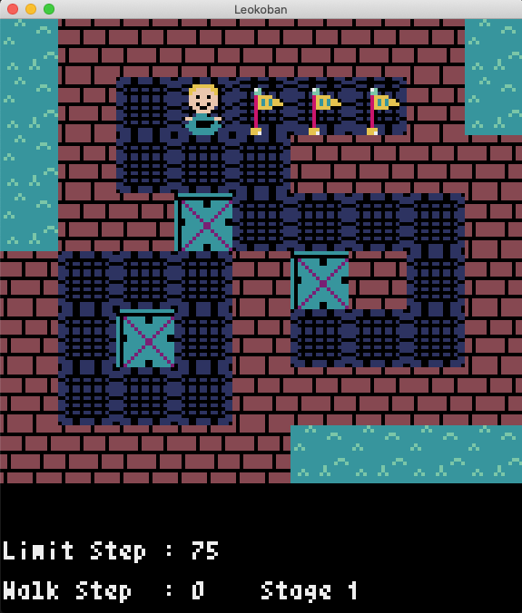

# Leokoban
This is a game called "Sokoban" made with Pyxel. This is my first project I will publish it!!
Sorry, the BGM is awfull.😭

Play a game "Leokoban" with using keyboard / USB game controller(Game pad)!!! (^-^)

## What is this about?
* Kind of like a Sokoban [Boxxle - Wikipedia](https://en.wikipedia.org/wiki/Boxxle)

### RULES
* You can push but you can't pull the box
* This game's goal is to move all boxes to the flag.
* If you walk to much and you go off the walk limit, you're game over.
* You can bump into walls, so you can't go anywhere.
* There are few stages I made for you, so please try it!

## How to play this thing?

* GamePad / Keyboard Arrow keys - Move

## The tips for you....

* R / L shoulder or N key / P key to go to the next stage or previous stage.
* R key or B key to restart that stage
* Look at those space in the stages! Maybe it will be usefull!😆
